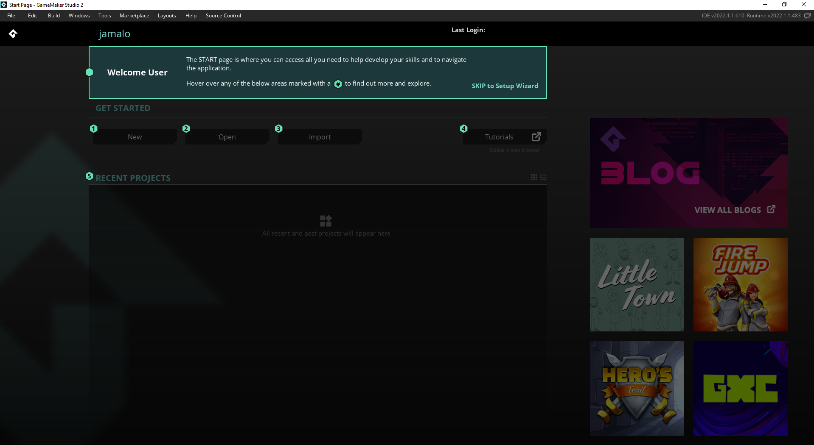

## Indice

- [Introducción](#introduccion)
- [¿Qué es?](#queEs)
- [Requisitos](#requisitos)
- [Licencias](#licencias)
- [Instalación](#instalacion)
- [Primeros pasos](#primerosPasos)
- [Referencias](#referencias)

## Introducción

GameMaker Studio 2 es una potente herramienta tanto para principiantes como para profesionales que te permite crear juegos 2D fácilmente. Las herramientas de GameMaker Studio 2 te permiten aprender sin agobios y a tu ritmo,además de organizar las cosas que necesites a tu manera.

## ¿Qué es?

GameMaker Studio 2 dispone de dos forma para desarrollar tu juego, por un lado se encuentra Drag and Drop (DND) y por el otro podemos escoger el lenguaje propio de GameMaker (GML)

### Drag and Drop

Drag and Drop lo suelen utilizar mayoritariamente los principiantes, y se trata de una herramienta de codificación visual ideal para empezar a crear juegos. 
Se puede elegir lo que se requiera a través de sus gran biblioteca de eventos y acciones para poder plasmar tu idea. 

Además se puede ver “detrás de escena” ya que cuenta con la función de vista previa de código.

### Lenguaje GameMaker (GML)

GameMaker lo suelen utilizar personas con más experiencia, ya que se puede utilizar su propio lenguaje de codificación. 

## Requisitos

Todas las instalaciones de GMS2 requieren al menos 3 GB de espacio libre en el disco duro, una conexión a internet (mínimo una vez al mes) y un sistema operativo de 64 bits para su instalación y ejecución. Solo esta disponible para los sistemas operativos de `Windows` y `Mac`.

| | Minimos | Recomendado |
| -- | -- | -- |
| ***Sistema operativo*** | Windows 7 con SP1 o macOS Mojave | Windows 10 o macOS Catalina |
| ***Procesador*** | CPU de doble núcleo | CPU de cuatros núcleos |
| ***RAM*** | 2GB | 8GB |
| ***Tarjeta gráfica*** | Gráficos integrados compatibles con OpenGL 4 | Gráfica dedicada |
| ***Disco duro*** | HDD | SSD|

## Licencias

| Free | Creator | Indie | Enterprise |
| -- | -- | -- | -- |
| GameMaker Studio 2 | GameMaker Studio 2 | GameMaker Studio 2 | GameMaker Studio 2 |
| Drag and Drop / GML | Drag and Drop / GML | Drag and Drop / GML | Drag and Drop / GML |
| Activos de juego ilimitados | Activos de juego ilimitados | Activos de juego ilimitados | Activos de juego ilimitados |
| Recursos de aprendizaje | Recursos de aprendizaje | Recursos de aprendizaje | Recursos de aprendizaje |
| Comunidad vibrante | Comunidad vibrante | Comunidad vibrante | Comunidad vibrante |
| | Exportaciones de escritorio | Exportaciones de escritorio | Exportaciones de escritorio	|
| | Acceso a la versión beta | Exportación de web | Exportación de web |
| | Acceso a YYC Performance | Exportaciones de móvil | Exportaciones de móvil |
| | Acceso a las extensiones | Exportación UWP | Exportación UWP |
| | | Acceso a la versión beta | PlayStation 4, PlayStation 5* |
| | | Acceso a YYC Performance | Xbox One, Xbox Series X\|S* |
| | | Acceso a las extensiones | Nintendo Switch* |
| | | | Acceso a la versión beta |
| | | | Acceso a YYC Performance |
| | | | Acceso a las extensiones |
| | | | Desarrollo en la línea de comandos |
| ***Gratis*** | ***4,25€/mes*** - ***42,50€/año*** | ***8,19€/mes*** - ***84,99€/año*** | ***67,99€/mes*** - ***679,99€/año*** |

> *Para acceder a las funciones de exportación de la consola, debes ser un desarrollador registrado para la plataforma seleccionada.

## Instalación

Debemos acceder a la web de GameMaker Studio 2 y crearnos una cuenta para poder descargar el instalador.

Una vez descargado ejecutamos el instalador y solo tenemos que darle siguiente hasta finalizar la instalación.

Para poder utilizar el IDE tenemos que iniciar sesión con la cuenta creada anteriormente.

> Vista principal del IDE

## Primeros pasos

Primeramente creamos un nuevo proyecto, dentro de este se crea el sprite al cual le añadiremos una imagen.

A continuación creamos un objeto que se le adjuntará el sprite creado anteriormente.

Seguidamente creamos una room,donde se va a visualizar el objeto.

Una vez agregado el objeto al Room debemos agregarle un evento para poder moverlo por dentro de la pantalla

> Evento de tipo Step

Creamos una variable para el movimiento

Agregamos el venteno de pulsar una tecla

Agregamos todas las flechas para poder mover al jugador

Y para finalizar ya podremos ver el objeto moviéndose en la pantalla.

## Referencias

- [WEB GameMaker Studio 2](https://www.yoyogames.com/es)
- [Documentación GameMaker Studio 2](https://manual-es.yoyogames.com/#t=Content.htm)
- [Tutoriales](https://www.yoyogames.com/es/tutorials)

> *Creador de contenidos relacionado con GameMaker Studio 2*

- [Adderly Céspedes (youtube)](https://www.youtube.com/channel/UCPyrFm1DOHoTwDPv5kQqARg)
- [WEB de Adderly Céspedes con contenido de GameMaker Studio 2](http://2ddentertainment.com/tut_pag/gm/game_maker.htm)

