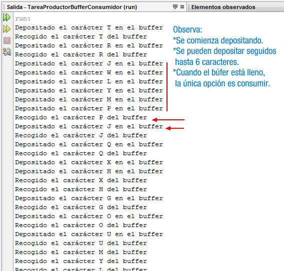

# Ejercicio Tema 2

Realiza un ejercicio del tipo productor-consumidor que mediante un hilo productor almacene datos (15 caracteres) en un búfer compartido, de donde los debe recoger un hilo consumidor (consume 15 caracteres). La capacidad del búfer ahora es de 6 caracteres, de manera que el consumidor podrá estar cogiendo caracteres del búfer siempre que éste no esté vacío. El productor sólo podrá poner caracteres en el búfer, cuando esté vacío o haya espacio.

