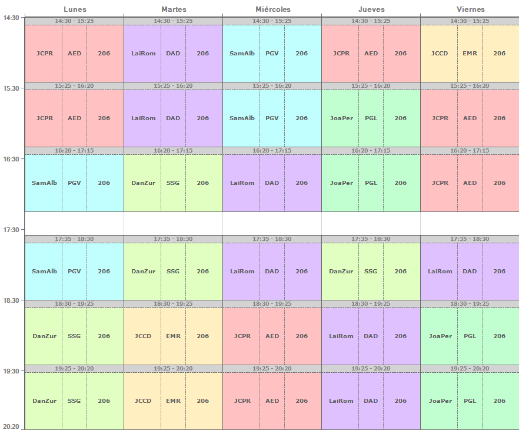

# 2º DAM (Desarrollo de Aplicaciones Multiplataforma)

| Asignaruta | Nombre | Maestro | Nombre | Correo |
| -- | -- | -- | -- | -- |
| AED | Acceso a datos | JCPR | Juan Carlos Pérez Rodríguez | |
| PGV | Programación de servicios y procesos | SamAlb | Samara Albertos Blanchard | |
| SSG | Sistemas de gestión empresarial | DanZur | Daniel Zurita Piñero (Tutor) | |
| DAD | Desarrollo de interfaces | LaiRom | Laia Romeo Fuentes | |
| PGL | Programación multimedia y dispositivos móviles | JoaPer | Joatham Pérez Expósito | |
| EMR | Empresa e iniciativa emprendedora | JCCD | Juan Carlos Cruz Díaz | |